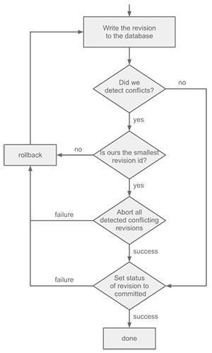

# HBase microkernel implementation details

Two concepts enable the implementation to ensure scalability. First, new revision ids are generated locally without any synchronization across multiple microkernel instances. And second, the HBase microkernel does not impose a global ordering of the revisions. Instead, each microkernel maintains its own sequence of committed revisions. This relaxation allows to reduce the synchronization and to implement concurrent write operations, only serializing conflicting ones.

## HBase schema and data model

The HBase microkernel uses two HBase tables: `nodes` and `journal`. The `journal` table is similar to the `commits` collection from the MongoDB microkernel, storing one row for each committed revision, using the revision ids as the row keys. Each row stores three columns: `committed`, `abort` and `message`. The `committed` column indicates if a revision is committed - and therefore valid - or not. If the value is `false`, the revision is not committed and ignored by read operations. Once set to `true`, the value may never be switched back to `false`. The `abort` column indicates if the revision has been marked as to-be-aborted by another microkernel. If `true`, the revision is aborted and will never be valid. The last column, `message`, stores the commit message passed to the `commit(...)` method.

The `nodes` table holds the repository data by storing one row for each node in the content tree. It uses the paths of the items as their row keys. Nodes contain three system properties used by the microkernel: `deleted`, `lastRevision` and `children`. The `deleted` flag indicates if a node has been deleted. The `lastRevision` column is used to detect concurrent modifications of a node and is set by each microkernel writing it. Finally, the `children` column stores a list containing the names of the direct children of the node. This list is needed for reading a tree of nodes and and faciliates getting a node’s child node count. JCR properties of a node are stored directly in the row of their parent node, their column names being the JCR property names. In order to differentiate between system properties and JCR properties, all column names are prefixed with a one-byte identifier. The value of a user property is stored as a sequence of bytes. Since HBase doesn’t store type information, this sequence is prefixed with a one-byte type identifier. When reading properties, this prefix can be used to reconstitute the correct value from the byte array. At any time, there exists only one HBase row for a given node. In order to store different revisions of a node, the microkernel makes use of HBase’s native versioning mechanism. When committing a new revision, only the columns that are actually modified are written to HBase. Their HBase version timestamp is set to the id of the revision being written. A column therefore stores a value for each revision it was written in. HBase must thus be configured such as to keep all versions of the columns of a row - by default only three versions are kept. When a node is deleted in a revision, it cannot be delete from HBase immediately as it must be kept for reads of the revisions in which it still existed. It is therefore marked as deleted using the corresponding flag, which instructs the microkernel to mask it in future reads. The node can then at a later time be garbage-collected and removed permanently from HBase.

## Generation of new revision ids

When committing a revision, microkernels have to generate new revision ids. These ids must be globally unique in order to prevent conflicts of two revisions having the same id. In order to accomplish this without having to use any synchronization mechanism, the revision ids are chosen after a specific format consisting of multiple components. Since HBase uses Java `long` integers as its version timestamps, the revision ids need to be 8 bytes of length. The `timestamp` component is a 5-byte integer representing the time the revision id was generated. It is measured in milliseconds, and in order to postpone the moment this value overflows, it counts the number of milliseconds elapsed since January 1st of 2013 at 00:00 (UTC). The `timestamp` component provides uniqueness for revision ids generated at different times. For ids generated within exactly the same millisecond, the format adds a `machine_id` component. It is a two-byte integer generated using the MAC address of the machine the microkernel runs on. The combination of the `timestamp` and `machine_id` components differentiates revision ids generated on different machines within the same millisecond. A third component, `counter`, is needed to distinguish ids generated at the same time and on the same machine. It is a one-byte integer that is incremented for every local commit happening within the same millisecond. The concatenation of these three components forms a long integer which is, under certain assumptions, guaranteed to be unique among all distributed microkernel instances. Additionally, the format allows the extraction of the age of an id and roughly sorts them by the time of their generation.

## Journal

Each microkernel instance maintains an in-memory journal which is based on the `journal` table. When being constructed, a microkernel scans the whole `journal` table and stores the sequence of valid (committed) revision ids in an in-memory data structure. In order to stay up to date, microkernels periodically poll the `journal` table, reading the latest committed entries and adding them to their in-memory journal. This is necessary for the microkernels to learn the revisions committed by other microkernels. There is no global head revision, instead, each microkernel has a local head revision, corresponding to the id currently at the head of its in-memory journal. The in-memory journal corresponds to the microkernel’s local view of the committed revisions and their ordering. In particular, at any given time, the revisions present in the local journals and their ordering can differ from one microkernel to another. Differences are due to the fact that the microkernels poll the `journal` table at different times. And, when microkernels commit a revision, they append its id directly to their in-memory journal, whereas other microkernels find out about it only later.

## Reading

When the `getNodes(...)` method is called, the microkernel has to read subtree of nodes at a specified revision. This subtree is retrieved with the help of the list of children stored in every node. First, the root of the subtree is fetched, then all of its children, its children’s children etc., until the depth limit is reached. This approach requires as many calls to HBase as there are levels in the tree of interest. The rows from the `nodes` table retrieved this way include all existing versions for each of their columns. From all those versions, the microkernel must, for each column, reconstruct its correct value at the specified revision. This is done by looking at the in-memory journal and selecting the appropriate value out of the set of all existing values. The algorithm used by the `getNodes(...)` method is outlined below:

1. Get a snapshot of the in-memory journal up to the revision to be read
2. Retrieve all nodes of the subtree, fetching the rows level by level
3. Parse each of the rows into a `Node` objects as follows:
  *  Loop through the revision ids of the journal from step (1) starting with the most recent id. Using the current id of the loop, test for each column if a value at that revision exists. If yes, use this value and discard the column for the rest of the loop.
  *  Mask columns for which no value has been found
  *  Mask nodes that are marked as deleted or don’t exist in this revision

## Writing

The HBase implementation reads the nodes involved in a commit before and after having written the changes. This approach guarantees that for each pair of conflicting revisions, at least one of them will detect the conflict. This is the case because HBase serializes writes to the same row. Therefore, if two revisions modify the same row in the course of a concurrent commit, the microkernel that comes second is guaranteed to detect the conflict. The algorithm implemented by the `commit(...)` method to write a new revision and detect conflicts doing so is shown below:

1. Generate a new revision id
2. Add an entry to the `journal` table with `committed` and `abort` set to `false`
3. Update the in-memory journal by reading the latest entries of the `journal` table
4. Lock the journal, pausing its periodic update for the duration of the commit
5. Read the nodes involved in this commit at the current head revision
6. Validate the changes of the commit with respect to the nodes read in step (5). If some changes are invalid, throw an exception.
7. Write the changes to HBase
8. Read back all rows written in step (7)
9. For each of these rows, compare the `lastRevision` column with the one read in step (5). If it has been set by at least one other revision in the meantime, then there has been a conflict.
10. If there has been a conflict, throw an exception.
11. Validate the revision by setting the `committed`flag in the entry of the `journal` table to `true`

Instead of handling the conflicts, step (10.) of the algorithm simply throws an exception. The idea for a conflict resolution strategy is to implement a retry-mechanism where microkernels, when detecting a conflict, retry their commit in the hope that in the meantime the competing microkernels have succeeded or been aborted. By carelessly retrying however, the system might get stuck in a scenario of repeated conflicts where no microkernel is ever able to commit its revision. In order to guarantee progress, the approach taken is to prioritize the revision with the lowest id. The retry-based conflict resolution algorithm is illustrated in figure at the bottom and explained in more detail in the following paragraph.

If a microkernel detects a conflict, it looks at the revision ids of all detected conflicting revisions. If its own revision id is not the smallest in the set, then it knows it has to yield and aborts the commit. It rolls back by removing the changes written in the course of the commit and restarts from step (1) of the write algorithm. If its revision id is the smallest, then the microkernel assumes to have priority. This might not necessarily be true as it is not guaranteed to detect all conflicting revisions. The microkernel proceeds with the commit, relying on microkernels with higher revision ids to abort. As those microkernels are not guaranteed to all detect the conflict, they have to be notified not to commit but to abort their revision and yield. To that end, the microkernel marks all of those revision as to-be-aborted by setting the `aborted` flag to `true` in their appropriate entry of the `journal` table. The `aborted` flag can only be set if the revision hasn’t already committed (i.e. set the `committed` flag to true). Therefore, the `aborted` flag is set in an atomic compare-and-set operation, verifying that `committed` is `false` and setting `aborted` to `true`. If the microkernel succeeds in aborting all conflicting revisions, it proceeds and tries to commit its own revision. On the other hand, if one of the revisions to be aborted has already been committed, then it must rollback and retry. When trying to commit its revision, it has to make sure not to have been marked as to-be-aborted by another revision. Therefore, it commits its revision in an atomic compare-and-set operation, setting `committed` to `true` only if `aborted` is `false`. The conflict resolution algorithm is shown below and replaces steps (10.) and (11.) of the aforementioned one:

11. Look at the ids of the detected conflicting revisions
12. If the own revision id is not the smallest in the set, rollback and retry
13. If the own revision id is the smallest, then assume to have priority:
  * Mark all detected conflicting revisions as to-be-aborted using an atomic compare-and-set operation
  * If this succeeds, try to commit the revision: set the committed flag to true using an atomic compare-and-set operation. If this fails, rollback and retry.
  * Else rollback and retry

